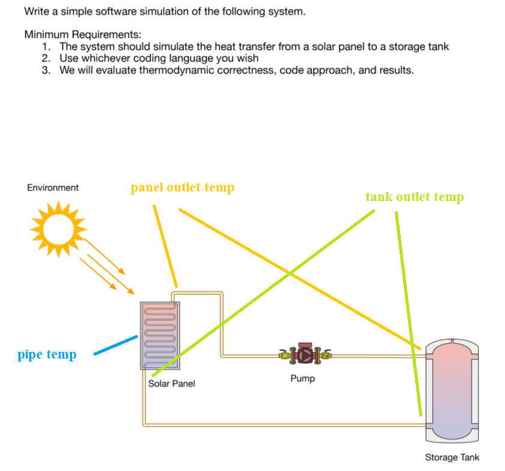
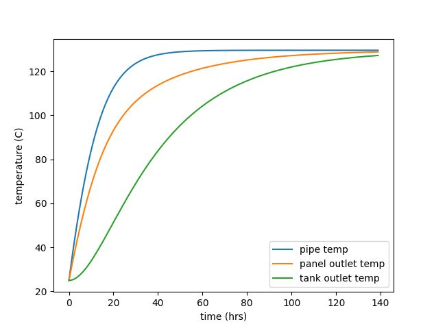
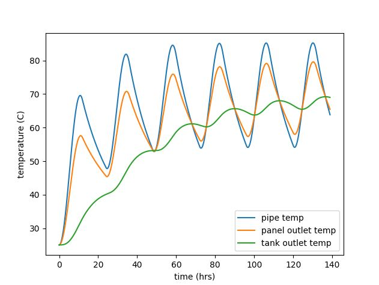

# Problem

This was a take-home coding test for a company and I thought it was a cool exercise on its own. The problem statement is as follows:

# Result

The graphs represent the evolution of temperatures of the fluid in various stages of the circuit. You have an option to simulate sunrise/sunset as well.

